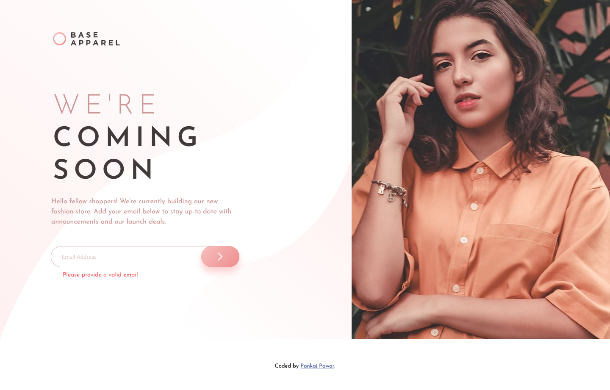
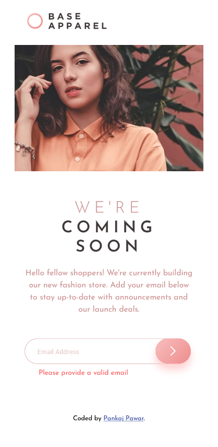

# Frontend Mentor - Base Apparel coming soon page solution

This is a solution to the [Base Apparel coming soon page challenge on Frontend Mentor](https://www.frontendmentor.io/challenges/base-apparel-coming-soon-page-5d46b47f8db8a7063f9331a0). Frontend Mentor challenges help you improve your coding skills by building realistic projects. 

## Table of contents

- [Overview](#overview)
  - [The challenge](#the-challenge)
  - [Screenshot](#screenshot)
  - [Links](#links)
- [My process](#my-process)
  - [Built with](#built-with)
  - [What I learned](#what-i-learned)
  - [Continued development](#continued-development)
  - [Useful resources](#useful-resources)
- [Author](#author)
- [Acknowledgments](#acknowledgments)

**Note: Delete this note and update the table of contents based on what sections you keep.**

## Overview

### The challenge

Users should be able to:

- View the optimal layout for the site depending on their device's screen size
- See hover states for all interactive elements on the page
- Receive an error message when the `form` is submitted if:
  - The `input` field is empty
  - The email address is not formatted correctly

### Screenshot

### Links

- Solution URL: [https://github.com/DamnItAzriel/base-apparel-coming-soon]
- Live Site URL: [https://base-apparel-coming-soon-wheat.vercel.app/]

## My process
- For mobile verion
  - Created HTML page as the design shows
    - div{logo}
    - div{heroImage}
    - div{content}
    - div{emailBox}
- For desktop version
  -Made changes to mobile version elements
    - Image for the desktop version is used using <picture> tag with srcset attribute
    - div{logo} made inline-block
      - To accomodate heroImage on right full size from top to bottom 
    - div{heroImage} floated to right
    - Specified approprite widths to the input[type=email] and input[type=submit]
- Submit Button
  - Margin given -ve to get this button on input[type=email]
  - Position absolute
  - Instead of text submit and icon arrow is added.
  - Hover effect is given and pointer cursor
  - Gradient added
- Input Field
  - On focus border color is different
  - If the required field is wrong, a background icon of  is shown in the right side of input field

### Built with

- Semantic HTML5 markup
- CSS custom properties

### What I learned

In this project, I learned key things listed below:
- Used box-sizing first time here. (Its awesome as you dont need to worry about widths of the elements anymore.)

- Aligning a heroImage to the right, stretching it top to bottom.
- Getting a submit button on right end of input field.
- Adding an icon for the submit button instead of text.
- Representing error with an error icon like this here .
- Hover effcts on submit button.
- Pseudoclasses chaining for input with required and invalid.

### Continued development

- I havent been able to style the error message if given email is wrong. Hence simply added the label in page. Will look at it in detail with some help.
- When page is viewed at more than 1440px the background-position: top left; gets messy and it goes away from body. Needs work here.

### Useful resources

- [Submit Btn Inside Input Field](http://www.java2s.com/example/html-css/css-form/html5-css-input-field-with-image-as-submitbutton-inside-the-input-f.html) - Clean webpage for embedding Btn in an input field.
- [Styling form input validity](https://www.digitalocean.com/community/tutorials/css-styling-form-input-validity) - This article has a method that can be used to add content after an input field which I would like to give try in future.

## Author

- Website - [Pankaj Pawar](https://twitter.com/DamnItAzriel)
  - Website in production. 
- Frontend Mentor - [@DamnItAzriel](https://www.frontendmentor.io/profile/DamnItAzriel)
- Twitter - [@DamnItAzriel](https://twitter.com/DamnItAzriel)

## Acknowledgments

I would like to thank frontend mentor who created projects like this so that people could refine their frontend skills. Helpful!
